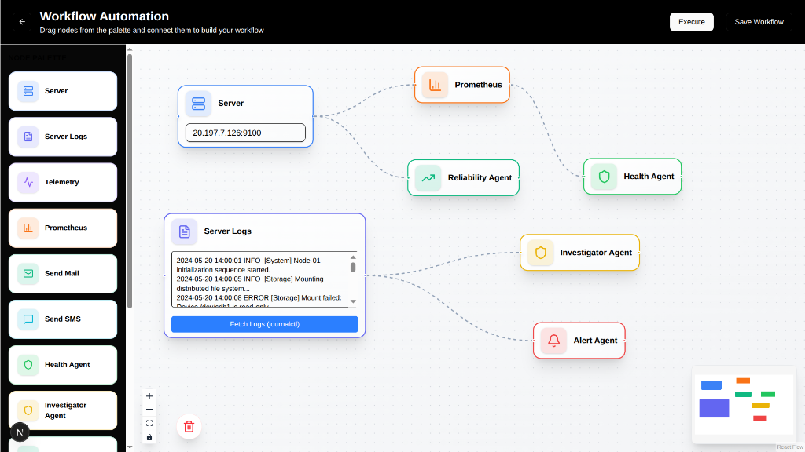
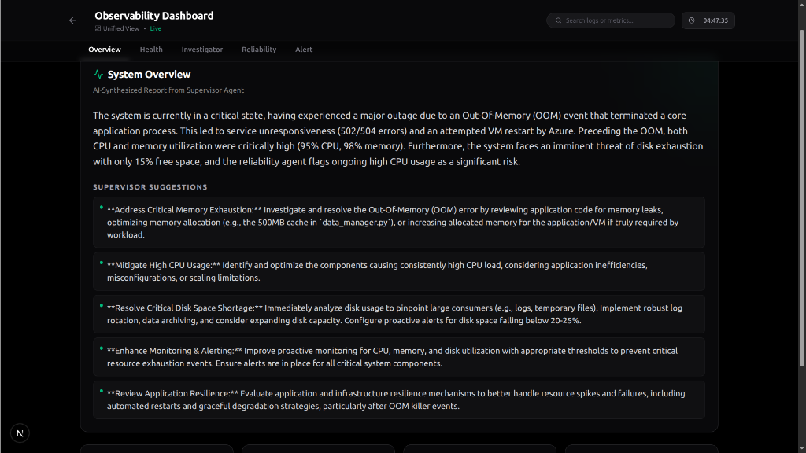
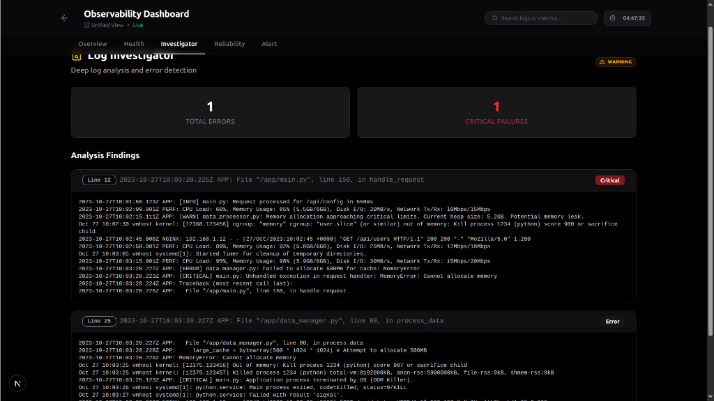
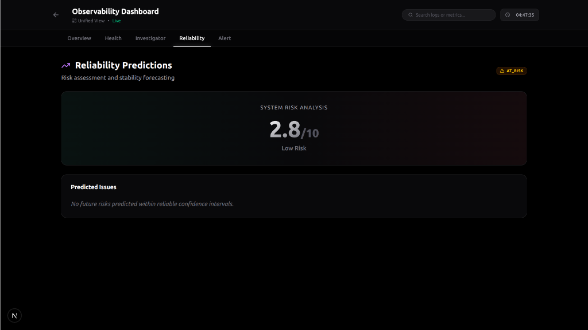
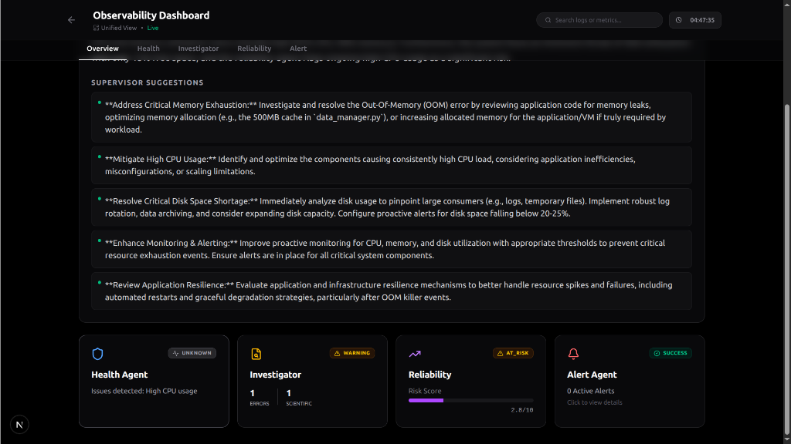

#  AutoFlow — Intelligent Developer Platform

**Build. Observe. Fix. Automatically.**

AutoFlow is an **end-to-end Intelligent Developer Platform** that unifies **CI/CD automation** and **agentic observability** into a single visual, workflow-driven system. It removes the complexity of manual pipeline setup and turns raw telemetry into actionable insights using AI agents.

---

## 🧠 Why AutoFlow?

Modern teams face two big problems:

1. **CI/CD is hard to set up**
   Writing and maintaining GitHub Actions YAML, Docker builds, and deployment workflows takes time and expertise.

2. **Observability is overwhelming**
   Metrics and logs exist (Prometheus, server logs), but teams still struggle to answer:

   > *Why is my system slow?*
   > *What caused this failure?*
   > *What should I fix first?*

**AutoFlow solves both — visually and intelligently.**

---

## ✨ What AutoFlow Does

### 🔹 AutoFlowBuild — Visual CI/CD Automation



* Connects to GitHub via OAuth
* Analyzes repository tech stack (Node, Python, FastAPI, etc.)
* Generates GitHub Actions pipelines using a **drag-and-drop visual editor**
* Commits workflows directly to `.github/workflows`

➡️ No YAML headaches. No DevOps expertise required.

---

### 🔹 AutoFlowObserve — Agentic Observability

* Ingests **Prometheus metrics**, logs, and (optionally) OpenTelemetry data
* Uses specialized **AI agents** to analyze telemetry
* Provides:

  * System health summaries
  * Root cause analysis
  * Failure predictions
  * Fix suggestions

➡️ Monitoring that *thinks*, not just charts.



---

## 🧩 Core Concepts

### 1️⃣ Workflow-Driven Platform

Everything in AutoFlow happens inside **visual workflows** (n8n-style):

* Data Sources → Agents → Actions
* Drag, connect, execute
* Same paradigm for CI/CD and observability

---

### 2️⃣ Agent-Based Intelligence

AutoFlow uses multiple specialized agents:

| Agent                  | Responsibility                                      |
| ---------------------- | --------------------------------------------------- |
| **Health Agent**       | Computes real-time system health from metrics       |
| **Investigator Agent** | Correlates logs & metrics to find root causes       |
| **Reliability Agent**  | Predicts future failures (disk, memory, load)       |
| **Alert Agent**        | Converts alerts into human-readable explanations    |
| **Supervisor Agent**   | Synthesizes all agent outputs into a single insight |


*Above: The Investigator Agent pinpointing a root cause.*


*Above: Reliability predictions and risk analysis.*


*Above: Supervisor Agent synthesizing fixes.*

Agents operate on **normalized signals**, not raw telemetry.

---

## 🖥️ Product Flow

### Phase 1: Build (CI/CD)

1. Login with GitHub
2. Select repository
3. AutoFlow analyzes the codebase
4. User builds a pipeline visually
5. YAML is generated and committed
6. GitHub Actions runs automatically

---

### Phase 2: Observe (Agentic Monitoring)

1. User opens the **Automation / Observability Canvas**
2. Adds data source nodes:

   * Prometheus
   * Logs
3. Connects agents visually
4. Executes the workflow
5. Agents analyze live data
6. Results appear in a unified dashboard

---

## 🧠 Observability Architecture (Important)

### Prometheus

* Prometheus scrapes metrics from the app / AKS cluster
* AutoFlow backend **pulls data from Prometheus**
* Metrics are parsed, reduced, and converted into signals

### OpenTelemetry (Optional)

* Apps can push traces/logs directly to AutoFlow via OTLP
* AutoFlow acts as an OTLP receiver

### Kubernetes / AKS

* AutoFlow **does not connect directly to AKS**
* Kubernetes metrics and logs are ingested via:

  * Prometheus
  * Loki / OTel collectors

➡️ This keeps the system **secure, cloud-agnostic, and cost-free**.

---

## 🏗️ Tech Stack

### Frontend

* **Next.js 16** (App Router)
* **React 19**
* **TypeScript**
* **Tailwind CSS 4**
* **Radix UI**
* **@xyflow/react (React Flow)** — visual workflows
* **@dnd-kit** — drag-and-drop

### Backend

* **FastAPI** (Python 3.11+)
* **Prometheus client & parsers**
* **Google Gemini Flash** (log analysis, synthesis)
* Modular architecture:

  * Router layer
  * Service layer
  * Agent layer

---

## 🧱 Architecture Overview

```
GitHub Repo
   ↓
AutoFlowBuild (Visual CI/CD)
   ↓
GitHub Actions (CI/CD)
   ↓
Deployed App
   ↓
Prometheus / Logs / OTel
   ↓
AutoFlowObserve
   ↓
AI Agents
   ↓
Insights / Alerts / Fixes
```

---

## 📊 Unified Dashboard

* All agent outputs shown in **one common dashboard**
* Each agent rendered as a separate section
* Ordered execution logs
* Supervisor summary at the top

➡️ No dashboard fatigue. Full clarity.

---

## 🔔 Notifications

* Slack-based alerts supported
* Triggered via agent decisions
* Human-readable messages with context and suggestions

---

## 🧪 Demo-Friendly Features

* Mock Prometheus data toggle
* Agent execution without real infra
* Safe fallback when telemetry is unavailable

Perfect for hackathons and demos.

---

## 💡 Innovation Highlights

* Visual programming for observability
* Agentic reasoning instead of passive monitoring
* Unified lifecycle: **Build → Observe → Fix**
* Premium, developer-first UX

---

## 🌍 Real-World Viability

* Ideal for:

  * Hackathon teams
  * Early-stage startups
  * Small-to-medium engineering teams
* No heavy infra provisioning
* Low AI cost (Gemini Flash)
* Stateless, horizontally scalable agents

---

## 💰 Business Model (Planned)

* **Free**: Public repositories
* **Pro ($29/month)**:

  * Private repos
  * Unlimited agent runs
  * Reliability predictions
* **Enterprise**:

  * Custom agents
  * On-premise deployment
  * SSO

---

## 🚧 Current Status

* ✅ Visual CI/CD builder
* ✅ Prometheus ingestion
* ✅ Workflow-based observability
* ✅ Health Agent
* 🚧 Advanced agent correlations
* 🚧 Auto-remediation workflows

---

## 🚀 Vision

AutoFlow aims to become a **virtual SRE for every team** — reducing firefighting, increasing confidence, and letting developers focus on what matters most: **building great products**.

---

## 📜 License

MIT License (or specify your chosen license)

---

## 🤝 Contributing

Contributions, ideas, and feedback are welcome!
Open an issue or submit a PR.

---

## 🚀 Getting Started

Follow these instructions to run AutoFlow locally.

### 📋 Prerequisites

* **Node.js**: v18 or higher (v20 recommended)
* **Python**: v3.11 or higher
* **Git**

### 🔧 Installation & Setup

#### 1. Clone the Repository
```bash
git clone https://github.com/alysajad/Team-Rygtus-Beach-Hack.git
cd Team-Rygtus-Beach-Hack
```

#### 2. Backend Setup (FastAPI)
```bash
cd backend

# Create virtual environment
python -m venv venv
source venv/bin/activate  # On Windows: venv\Scripts\activate

# Install dependencies
pip install -r requirements.txt

# Configure Environment
# Copy the example env file (ensure you have a GEMINI_API_KEY)
# Create .env in backend/app/
cp .env.example app/.env
```

To run the backend:
```bash
# Start the server
uvicorn app.main:app --reload --port 8000
```
*Backend runs on: http://localhost:8000*

#### 3. Frontend Setup (Next.js)
```bash
cd ../frontend

# Install dependencies
npm install --force

# Run the development server
npm run dev
```
*Frontend runs on: http://localhost:3000*

---

## 🧪 Quick Test (Simulation)

AutoFlow comes with a built-in log simulator to demonstrate the Agentic Observability without needing a real outage.

1. **Generate Dummy Logs**:
   ```bash
   cd backend
   python3 generate_scenario_logs.py
   ```
   *This uses Gemini to create a realistic `simulated_outage.log` file with OOM errors and Azure activity.*

2. **Open Dashboard**:
   Go to **[http://localhost:3000/observability/dashboard](http://localhost:3000/observability/dashboard)**

3. **See it in Action**:
   The **Investigator Agent** will automatically analyze the simulated log file and pinpoint the root cause (Memory Leak).

---

## 🔗 Repository Details

* **GitHub Repo**: [https://github.com/alysajad/Team-Rygtus-Beach-Hack](https://github.com/alysajad/Team-Rygtus-Beach-Hack)
* **Main Branch**: `kdev`

---

## 🧠 One-Line Summary

> **AutoFlow brings AI-powered intelligence to the entire DevOps lifecycle — from deployment to diagnosis.**

---

